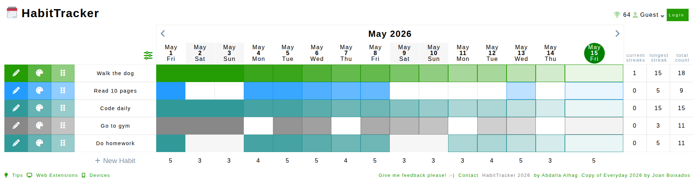

# Habit Tracker

A full-stack habit tracking application that helps users build consistency, track progress, and stay accountable with daily habits.

## Screenshots



## Features

- Create, edit, and delete habits
- Track daily habit completion
- Visual progress tracking
- Streak tracking system
- Responsive UI
- Persistent data storage
- Clean and modern interface

## Tech Stack

**Client:** JavaScript, HTML, CSS

**Server:** Node, Express, MongoDB, Railway

**Dependencies:** bcrypt, cors, dotenv, express, mongoose, nodemon

## Installation

Clone the repository:

```bash
git clone https://github.com/AbdallaAlhag/HabitTracker.git
cd HabitTracker
```

Install dependencies:

```bash
npm install
```

Create a .env file in the root directory and add the following:

```bash
MONGO_URI=your_mongodb_connection_string
PORT=4000
```

Start the development server:

```bash
npm run dev
```

The app should now be running on:

```bash
http://localhost:4000
```

## Project Structure

```bash
HabitTracker/
│
├── public/             # Frontend code
├── models/             # Database models
├── routes/             # API routes
├── controllers/        # Route controllers
├── server.js           # Start server, connect to db
├── app.js              # Route app
├── .env
├── package.json
└── README.md
```

## Learning Goals

- Full-stack web development
- REST API design
- CRUD operations
- MongoDB integration
- State management
- Responsive frontend design

## Future Improvement

- User authentication
- Habit categories
- Weekly/monthly analytics
- Notifications and reminders
- Dark mode
- Mobile app version
